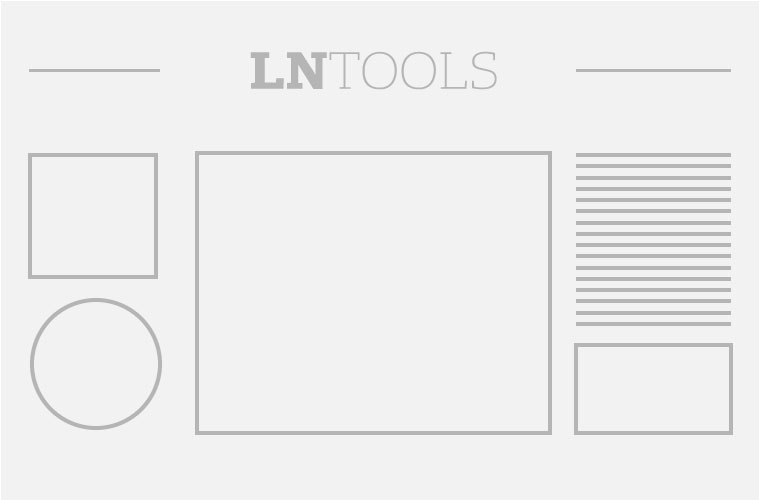

# <%= appname %>  

## <%= description %>  




## Activar el Live preview en Autotune

[Autotune live preview Documentation](https://github.com/voxmedia/autotune/wiki/Enabling-live-preview-on-a-blueprint)


## Commands: 

### Install dependences

```bash
npm install && bower install
```


### Run server for dev

```bash
gulp
```


### Build Project

```bash
gulp build
```


### Build Project For Autotune

```bash
gulp build-autotune
```


### Make manifest file

```bash
gulp make_manifest
```


### Build Sass

```bash
gulp sass
```


### Publish on Github pages

```bash
npm run test
```


### Publish on Github pages

```bash
npm run publish_gh_pages
```


### Claen build

```bash
gulp clean_build
```


## Contenido de Directorios:

. <br>
├── gulp-tasks: tareas de GULP<br>
└── node_modules: dependencias de Node, esta carpeta no debe estar en GIT  <br>
└── source: carpeta que contiene el código fuente de la app <br>


<% if (autotuneProject) { -%>

## Archivos de configuración

### autotune-config.json

[Autotune Documentation](https://github.com/voxmedia/autotune/wiki/File-info%3A-autotune-config.json)

### autotune-build:

[Autotune Documentation](https://github.com/kavyasukumar/autotune-slideshow/blob/master/autotune-build)


<% } -%>


### gulp_opts.js

Commons vars for gulp tasks
